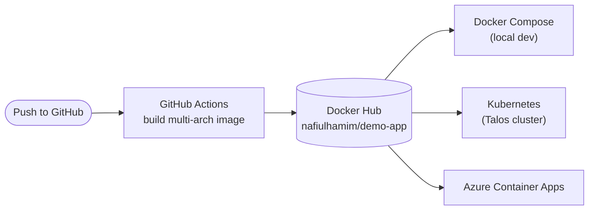
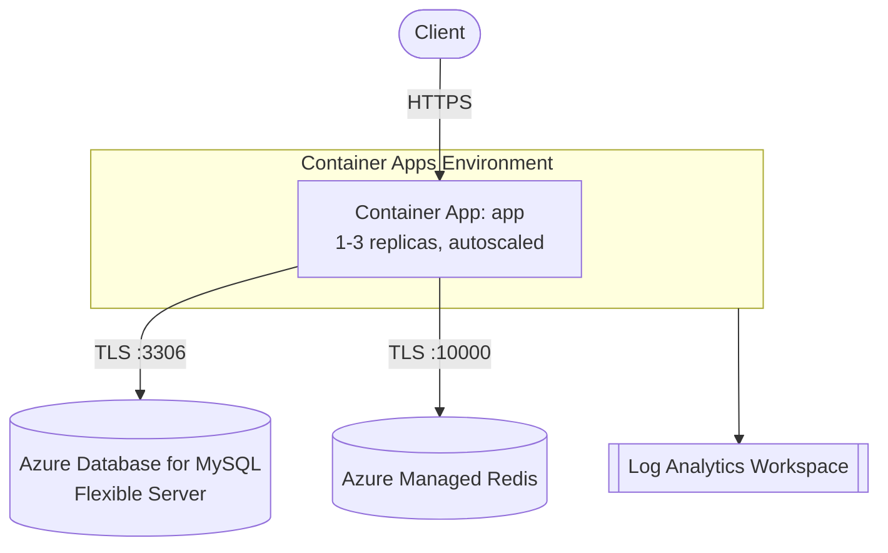

# Cloud Infrastructure Project

A small Go web app (MySQL + Redis backend) taken from containerized development through to
production-style deployment on Kubernetes, with Terraform-provisioned Azure infrastructure and a
CI/CD pipeline layered on top.

Originated from a Cloud Computing lab at the University of Stavanger; reworked and extended here
as an ongoing personal infrastructure project.

## Architecture

**CI/CD → three deployment targets, same image:**



**The Azure deployment in detail** (what `terraform/` provisions):



Request flow: a client hits the app's public HTTPS endpoint → Container Apps routes it to one of
1–3 running replicas (scales out automatically under load) → that replica makes outbound TLS
connections to MySQL and Redis as needed. Nothing here is a VM you manage directly — the app tier
is a container on Microsoft-managed shared compute, and MySQL/Redis are managed PaaS services
(each backed by its own dedicated compute, but patched, backed up, and operated by Azure, not you).

## Structure

- [`docker-compose-app/`](docker-compose-app/) — the Go app, Dockerfiles, and Docker Compose stack
  (app + MySQL + Redis + nginx), with separate dev/prod compose files and Docker secrets for
  database credentials.
- [`kubernetes-manifests/`](kubernetes-manifests/) — the same stack migrated to Kubernetes:
  Deployments, Services, PersistentVolumeClaims, and ConfigMaps per tier, an nginx reverse proxy,
  and a Horizontal Pod Autoscaler (2→5 replicas on 50% CPU).
- [`terraform/`](terraform/) — Azure infrastructure as code: Container Apps, Azure Database for
  MySQL Flexible Server, Azure Managed Redis.
- [`.github/workflows/`](.github/workflows/) — builds and pushes the app image to Docker Hub on
  every change under `docker-compose-app/app/`.

## Stack

Go · MySQL · Redis · nginx · Docker Compose · Kubernetes · Terraform · Azure · GitHub Actions

## Running locally

```bash
cd docker-compose-app/stack
cp secrets/db_password.txt.example secrets/db_password.txt
cp secrets/db_root_password.txt.example secrets/db_root_password.txt
# edit the copied files with your own values, then:
docker compose up --build
```
